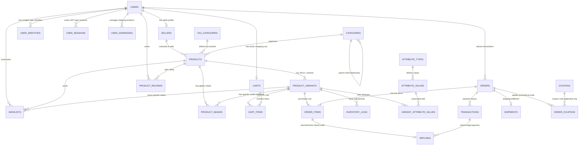

# E-Commerce Database Schema & Requirements Document (Enterprise Grade)
## Target Database: MySQL v8.0+ | ORM: Drizzle ORM

This document outlines the enterprise-grade database schema, relational designs, indexing rules, strict datatypes, normalization criteria, and scaling guidelines to support a high-concurrency Node.js e-commerce platform handling **100,000 concurrent order requests**.

---

## 1. Database Architecture & Design Standards

### 1.1 Enterprise Naming Conventions
*   **Tables**: Lowercase, snake_case, plural nouns (e.g., `users`, `product_variants`).
*   **Columns**: Lowercase, snake_case (e.g., `first_name`, `payable_amount`).
*   **Primary Keys**: Always named `id`, using UUID v4 (`CHAR(36)`) for general tables, and auto-increment `BIGINT` for lookup/log tables.
*   **Foreign Keys**: Column name must exactly match the referenced table's singular name appended with `_id` (e.g., `user_id` referencing `users.id`).
*   **Indexes**:
    *   Primary Key: `pk_<table_name>` (implicit in MySQL)
    *   Unique Index: `uq_<table_name>_<column_names>`
    *   Standard Index: `idx_<table_name>_<column_names>`
    *   Foreign Key Constraint: `fk_<source_table>_<target_table>`

### 1.2 Data Type Policies
*   **Currency & Prices**: Always use `DECIMAL(15, 4)` for product prices, discounts, tax amounts, and totals. This supports precise multi-decimal calculations (preventing rounding errors) and handles global currencies.
*   **Booleans**: Represented as `TINYINT(1)` (e.g., `is_active`, `is_verified`).
*   **Dates & Timestamps**: Always use timezone-independent `DATETIME` or UTC `TIMESTAMP` for dates. Every primary entity must have:
    *   `created_at TIMESTAMP NOT NULL DEFAULT CURRENT_TIMESTAMP`
    *   `updated_at TIMESTAMP NOT NULL DEFAULT CURRENT_TIMESTAMP ON UPDATE CURRENT_TIMESTAMP`
*   **IP Addresses**: Stored as `VARCHAR(45)` to support both IPv4 and IPv6 addresses.
*   **JSON Fields**: Used selectively for non-searchable schema-less attributes (e.g., variant configurations, raw payment gateway responses, user logs) to maintain Third Normal Form (3NF) for searchable entities.

#### 1.3 Strict Normalization & Strategic De-normalization
*   **Cart Normalization**: Cart data is normalized into `carts` and `cart_items` tables instead of a single JSON column. This allows rapid queries, item-level changes, and relational checking.
*   **Product Attributes Normalization**: Instead of storing variant options in a JSON block, attributes are fully normalized using `attribute_types` (e.g., Color, Size), `attribute_values` (e.g., Blue, XL), and `variant_attribute_values` (joins variant to attributes) tables.
*   **Default Variant Pattern for Stock & Simple Products**:
    *   To prevent structural discrepancies, **every product has at least one variant record** in the database.
    *   For products without visible variants (simple products), the system automatically creates a single implicit **default variant** with empty attributes.
    *   Stock levels (`stock`) and inventory movement auditing (`inventory_logs`) always target the `product_variants` record, maintaining a single, consistent, high-scale inventory ingestion pipeline.
*   **Base vs Variant Cost & Price Management**:
    *   Base prices and costs are defined on the `products` table (`base_price`, `base_cost`).
    *   Variants can override these values using nullable fields (`price`, `cost`). If the variant price/cost is NULL, it falls back to the product's base price/cost.
*   **Product Image Management Standard**:
    *   To support multiple media assets per product/variant, a normalized `product_images` table is utilized.
    *   If `variant_id` is NULL, the image represents a general product lifestyle or gallery image.
    *   If `variant_id` is set, the image is specific to that variation (e.g., red color variant), enabling frontend swapping when option selectors change.
    *   `sort_order` and `is_primary` handle thumbnail sorting and main gallery ranking.
*   **Auditability & Strategic De-normalization (Order History)**:
    *   Catalog prices, product descriptions, and tax rates can change dynamically.
    *   To maintain historical invoice integrity, fields like product name, variant details, pricing, and tax rates are **de-normalized (snapshotted)** into `order_items` at the exact time of order placement.
*   **Stock Ledger (Inventory Logs)**:
    *   To track stock adjustments, a transactional ledger table `inventory_logs` records every stock change (restocks, orders, refunds, cancellations). This ensures auditability and eliminates single-column increment discrepancies.

---

## 2. Entity Relationship Diagram (Conceptual)




---

## 3. Data Dictionary & Table Schemas

### 3.1 `users` Table
Stores basic profile and role details for Buyers, Sellers, and Admins.

| Column Name | Data Type | Nullable | Constraints | Description |
| :--- | :--- | :--- | :--- | :--- |
| `id` | `CHAR(36)` | NO | Primary Key | UUID v4 |
| `name` | `VARCHAR(100)` | NO | - | Full name |
| `email` | `VARCHAR(150)` | YES | UNIQUE | Email (Nullable for phone-only/SSO signups) |
| `phone` | `VARCHAR(15)` | YES | UNIQUE | Contact number (Nullable for email/social signups) |
| `role` | `ENUM` | NO | - | Roles: `buyer`, `seller`, `super_admin` |
| `is_verified` | `TINYINT(1)` | NO | DEFAULT 0 | Verification flag |
| `created_at` | `TIMESTAMP` | NO | DEFAULT CURRENT_TIMESTAMP | - |
| `updated_at` | `TIMESTAMP` | NO | DEFAULT CURRENT_TIMESTAMP ON UPDATE | - |

*   **Indexes**:
    *   `uq_users_email` on `email` (Unique, Nullable)
    *   `uq_users_phone` on `phone` (Unique, Nullable)
    *   `idx_users_role` on `role`

---

### 3.2 `user_identities` Table
Supports decoupling of authentication providers (Local login, Google, Apple OAuth, SAML/SSO).

| Column Name | Data Type | Nullable | Constraints | Description |
| :--- | :--- | :--- | :--- | :--- |
| `id` | `CHAR(36)` | NO | Primary Key | UUID v4 |
| `user_id` | `CHAR(36)` | NO | FK -> `users(id)` ON DELETE CASCADE | Profile association |
| `provider` | `VARCHAR(50)` | NO | - | e.g. `local`, `google`, `apple`, `phone_otp`, `sso` |
| `provider_user_id`| `VARCHAR(255)`| NO | - | Target unique user ID in third-party provider |
| `password_hash`| `VARCHAR(255)` | YES | - | Backup password storage |
| `created_at` | `TIMESTAMP` | NO | DEFAULT CURRENT_TIMESTAMP | - |
| `updated_at` | `TIMESTAMP` | NO | DEFAULT ... ON UPDATE | - |

*   **Indexes**:
    *   `uq_identities_provider_uid` Unique composite on `(provider, provider_user_id)`
    *   `idx_identities_user_id` on `user_id`

---

### 3.3 `user_sessions` Table
Stores login/logout timings and active tokens for session audits.

| Column Name | Data Type | Nullable | Constraints | Description |
| :--- | :--- | :--- | :--- | :--- |
| `id` | `CHAR(36)` | NO | Primary Key | UUID v4 |
| `user_id` | `CHAR(36)` | NO | FK -> `users(id)` ON DELETE CASCADE | Associated user |
| `jwt_jti` | `VARCHAR(255)` | NO | UNIQUE | JWT Unique Identifier |
| `ip_address` | `VARCHAR(45)` | YES | - | Client IP |
| `user_agent` | `TEXT` | YES | - | Browser user agent string |
| `login_time` | `TIMESTAMP` | NO | DEFAULT CURRENT_TIMESTAMP | Logger login time |
| `logout_time` | `TIMESTAMP` | YES | - | Logger logout time |
| `expires_at` | `TIMESTAMP` | NO | - | Expiration limit |
| `status` | `ENUM` | NO | DEFAULT 'active' | Session status: `active`, `logged_out`, `expired` |

*   **Indexes**:
    *   `uq_sessions_jwt_jti` on `jwt_jti` (Unique)
    *   `idx_sessions_user_login` composite on `(user_id, login_time)`

---

### 3.4 `sellers` Table
Extended profiles for verified vendors.

| Column Name | Data Type | Nullable | Constraints | Description |
| :--- | :--- | :--- | :--- | :--- |
| `id` | `CHAR(36)` | NO | Primary Key | UUID v4 |
| `user_id` | `CHAR(36)` | NO | UNIQUE, FK -> `users(id)` ON DELETE CASCADE | Link to base user profile |
| `company_name` | `VARCHAR(150)` | NO | - | Business entity name |
| `gstin` | `VARCHAR(15)` | NO | UNIQUE | Tax registration ID |
| `status` | `ENUM` | NO | DEFAULT 'pending' | `pending`, `approved`, `suspended` |
| `bank_details` | `JSON` | YES | - | Encrypted bank layout mapping |
| `created_at` | `TIMESTAMP` | NO | DEFAULT CURRENT_TIMESTAMP | - |
| `updated_at` | `TIMESTAMP` | NO | DEFAULT ... ON UPDATE | - |

---

### 3.5 `tax_categories` Table
Look-up table for regional sales tax rules.

| Column Name | Data Type | Nullable | Constraints | Description |
| :--- | :--- | :--- | :--- | :--- |
| `id` | `INT` | NO | Primary Key, AUTO_INCREMENT | Identifier |
| `name` | `VARCHAR(50)` | NO | - | Tax code name (e.g. GST-18, GST-0) |
| `rate` | `DECIMAL(5,2)` | NO | DEFAULT 0.00 | Rate percentage (e.g. 18.00) |
| `created_at` | `TIMESTAMP` | NO | DEFAULT CURRENT_TIMESTAMP | - |
| `updated_at` | `TIMESTAMP` | NO | DEFAULT ... ON UPDATE | - |

---

### 3.6 `categories` Table
Nested inventory categories.

| Column Name | Data Type | Nullable | Constraints | Description |
| :--- | :--- | :--- | :--- | :--- |
| `id` | `INT` | NO | Primary Key, AUTO_INCREMENT | Category reference |
| `name` | `VARCHAR(100)` | NO | - | Category title |
| `slug` | `VARCHAR(120)` | NO | UNIQUE | SEO path URL slug |
| `parent_id` | `INT` | YES | FK -> `categories(id)` ON DELETE SET NULL | Self-reference parent key |
| `description` | `TEXT` | YES | - | Category explanation |

*   **Indexes**:
    *   `uq_categories_slug` on `slug` (Unique)
    *   `idx_categories_parent` on `parent_id`

---

### 3.7 `products` Table
Product parent entity.

| Column Name | Data Type | Nullable | Constraints | Description |
| :--- | :--- | :--- | :--- | :--- |
| `id` | `CHAR(36)` | NO | Primary Key | UUID v4 |
| `seller_id` | `CHAR(36)` | NO | FK -> `sellers(id)` ON DELETE RESTRICT | Vendor ownership |
| `name` | `VARCHAR(200)` | NO | - | Product heading |
| `slug` | `VARCHAR(255)` | NO | UNIQUE | SEO URL slug |
| `description` | `TEXT` | NO | - | Detailed description |
| `category_id` | `INT` | NO | FK -> `categories(id)` ON DELETE RESTRICT | Category classification |
| `tax_category_id`| `INT` | NO | FK -> `tax_categories(id)` ON DELETE RESTRICT | Applicable tax rate |
| `brand` | `VARCHAR(100)` | YES | - | Brand name |
| `type` | `ENUM` | NO | DEFAULT 'physical' | `physical`, `digital`, `service` |
| `base_price` | `DECIMAL(15,4)`| NO | DEFAULT 0.0000 | Default listing price for simple products or baseline price |
| `base_cost` | `DECIMAL(15,4)`| NO | DEFAULT 0.0000 | Default cost of goods for simple products or baseline cost |
| `is_active` | `TINYINT(1)` | NO | DEFAULT 1 | Soft deletion toggle |
| `created_at` | `TIMESTAMP` | NO | DEFAULT CURRENT_TIMESTAMP | - |
| `updated_at` | `TIMESTAMP` | NO | DEFAULT ... ON UPDATE | - |

*   **Indexes**:
    *   `uq_products_slug` on `slug` (Unique)
    *   `idx_products_seller` on `seller_id`
    *   `idx_products_category` on `category_id`

---

### 3.8 `product_variants` Table
Line-level SKU variations. Even simple products contain at least one implicit default variant linking to stock.

| Column Name | Data Type | Nullable | Constraints | Description |
| :--- | :--- | :--- | :--- | :--- |
| `id` | `CHAR(36)` | NO | Primary Key | UUID v4 |
| `product_id` | `CHAR(36)` | NO | FK -> `products(id)` ON DELETE CASCADE | Associated product parent |
| `sku` | `VARCHAR(100)` | NO | UNIQUE | Stock Keeping Unit |
| `price` | `DECIMAL(15,4)`| YES | - | Listing price override. If NULL, falls back to products.base_price |
| `discount_price`| `DECIMAL(15,4)`| YES | - | Promotional price override. If NULL, falls back to standard discount logic |
| `cost` | `DECIMAL(15,4)`| YES | - | Cost of goods override. If NULL, falls back to products.base_cost |
| `stock` | `INT` | NO | DEFAULT 0 | Fast read cache stock level |
| `version` | `INT` | NO | DEFAULT 1 | Optimistic concurrency control lock |
| `created_at` | `TIMESTAMP` | NO | DEFAULT CURRENT_TIMESTAMP | - |
| `updated_at` | `TIMESTAMP` | NO | DEFAULT ... ON UPDATE | - |

*   **Indexes**:
    *   `uq_variants_sku` on `sku` (Unique)
    *   `idx_variants_product` on `product_id`

---

### 3.9 `attribute_types` Table
Stores generic variant categories (e.g., Color, Size, Storage Capacity).

| Column Name | Data Type | Nullable | Constraints | Description |
| :--- | :--- | :--- | :--- | :--- |
| `id` | `INT` | NO | Primary Key, AUTO_INCREMENT | Attribute type identifier |
| `name` | `VARCHAR(50)` | NO | UNIQUE | Attribute name (e.g., 'Color', 'Size') |
| `created_at` | `TIMESTAMP` | NO | DEFAULT CURRENT_TIMESTAMP | - |
| `updated_at` | `TIMESTAMP` | NO | DEFAULT ... ON UPDATE | - |

*   **Indexes**:
    *   `uq_attribute_types_name` on `name` (Unique)

---

### 3.10 `attribute_values` Table
Stores pre-defined selectable option values belonging to an attribute type (e.g., Red, Blue, XL, 128GB).

| Column Name | Data Type | Nullable | Constraints | Description |
| :--- | :--- | :--- | :--- | :--- |
| `id` | `INT` | NO | Primary Key, AUTO_INCREMENT | Attribute value identifier |
| `attribute_type_id`| `INT` | NO | FK -> `attribute_types(id)` ON DELETE CASCADE | Associated attribute type |
| `value` | `VARCHAR(100)` | NO | - | Option value (e.g., 'Red', 'XL') |
| `created_at` | `TIMESTAMP` | NO | DEFAULT CURRENT_TIMESTAMP | - |
| `updated_at` | `TIMESTAMP` | NO | DEFAULT ... ON UPDATE | - |

*   **Indexes**:
    *   `uq_attribute_values_composite` Unique composite on `(attribute_type_id, value)`
    *   `idx_attribute_values_type` on `attribute_type_id`

---

### 3.11 `variant_attribute_values` Table
Normalized join table linking a specific product variant SKU to one or more attribute values (supporting multi-attribute variants, e.g., a shirt variant with Red color AND XL size).

| Column Name | Data Type | Nullable | Constraints | Description |
| :--- | :--- | :--- | :--- | :--- |
| `id` | `CHAR(36)` | NO | Primary Key | UUID v4 |
| `variant_id` | `CHAR(36)` | NO | FK -> `product_variants(id)` ON DELETE CASCADE | Target product variant SKU |
| `attribute_value_id`| `INT` | NO | FK -> `attribute_values(id)` ON DELETE RESTRICT | Linked attribute value |
| `created_at` | `TIMESTAMP` | NO | DEFAULT CURRENT_TIMESTAMP | - |

*   **Indexes**:
    *   `uq_variant_attributes_composite` Unique composite on `(variant_id, attribute_value_id)`
    *   `idx_variant_attributes_value` on `attribute_value_id`

---


### 3.12 `product_images` Table
Stores URLs of product media assets, supporting sorting, thumbnail designation, and variant-specific filtering.

| Column Name | Data Type | Nullable | Constraints | Description |
| :--- | :--- | :--- | :--- | :--- |
| `id` | `CHAR(36)` | NO | Primary Key | UUID v4 |
| `product_id` | `CHAR(36)` | NO | FK -> `products(id)` ON DELETE CASCADE | Associated product parent |
| `variant_id` | `CHAR(36)` | YES | FK -> `product_variants(id)` ON DELETE CASCADE | Optional variant override (e.g. color-specific images) |
| `image_url` | `VARCHAR(512)`| NO | - | Media URL (e.g. AWS S3/Cloudinary bucket path) |
| `sort_order` | `INT` | NO | DEFAULT 0 | Ordering sequence for gallery display |
| `is_primary` | `TINYINT(1)` | NO | DEFAULT 0 | Thumbnail flag (1 = main image, 0 = gallery image) |
| `created_at` | `TIMESTAMP` | NO | DEFAULT CURRENT_TIMESTAMP | - |
| `updated_at` | `TIMESTAMP` | NO | DEFAULT ... ON UPDATE | - |

*   **Indexes**:
    *   `idx_images_product` on `product_id`
    *   `idx_images_variant` on `variant_id`

---

### 3.13 `inventory_logs` Table
A ledger of all inventory transactions. Crucial for enterprise accounting.

| Column Name | Data Type | Nullable | Constraints | Description |
| :--- | :--- | :--- | :--- | :--- |
| `id` | `BIGINT` | NO | Primary Key, AUTO_INCREMENT | Ledger ID |
| `variant_id` | `CHAR(36)` | NO | FK -> `product_variants(id)` ON DELETE RESTRICT | Target variation |
| `change_amount` | `INT` | NO | - | Count delta, e.g. `-1` (deduction), `+50` (intake) |
| `event_type` | `ENUM` | NO | - | `restock`, `order_placed`, `order_cancelled`, `refund_return`, `adjustment` |
| `reference_id` | `CHAR(36)` | YES | - | Associated target Order ID or Refund ID |
| `created_at` | `TIMESTAMP` | NO | DEFAULT CURRENT_TIMESTAMP | Adjustment timestamp |

*   **Indexes**:
    *   `idx_inventory_logs_variant` on `variant_id`
    *   `idx_inventory_logs_reference` on `reference_id`

---

### 3.14 `carts` Table
Cart lookup table mapping users/sessions.

| Column Name | Data Type | Nullable | Constraints | Description |
| :--- | :--- | :--- | :--- | :--- |
| `id` | `CHAR(36)` | NO | Primary Key | UUID v4 |
| `user_id` | `CHAR(36)` | YES | UNIQUE, FK -> `users(id)` ON DELETE CASCADE | Associated client |
| `session_token`| `VARCHAR(255)`| YES | - | Guest cart anonymous token identifier |
| `created_at` | `TIMESTAMP` | NO | DEFAULT CURRENT_TIMESTAMP | - |
| `updated_at` | `TIMESTAMP` | NO | DEFAULT ... ON UPDATE | - |

---

### 3.15 `cart_items` Table
Normalized table storing specific variants added by customer.

| Column Name | Data Type | Nullable | Constraints | Description |
| :--- | :--- | :--- | :--- | :--- |
| `id` | `CHAR(36)` | NO | Primary Key | UUID v4 |
| `cart_id` | `CHAR(36)` | NO | FK -> `carts(id)` ON DELETE CASCADE | Parent cart |
| `variant_id` | `CHAR(36)` | NO | FK -> `product_variants(id)` ON DELETE CASCADE | Selected item variation |
| `quantity` | `INT` | NO | DEFAULT 1 | Item quantity |
| `created_at` | `TIMESTAMP` | NO | DEFAULT CURRENT_TIMESTAMP | - |
| `updated_at` | `TIMESTAMP` | NO | DEFAULT ... ON UPDATE | - |

*   **Indexes**:
    *   `uq_cart_items_composite` Unique index on `(cart_id, variant_id)`

---

### 3.16 `user_addresses` Table
Billing and shipping target addresses.

| Column Name | Data Type | Nullable | Constraints | Description |
| :--- | :--- | :--- | :--- | :--- |
| `id` | `CHAR(36)` | NO | Primary Key | UUID v4 |
| `user_id` | `CHAR(36)` | NO | FK -> `users(id)` ON DELETE CASCADE | Owner address |
| `address_line_1`| `VARCHAR(255)`| NO | - | Primary address line |
| `address_line_2`| `VARCHAR(255)`| YES | - | Apartment/Suite details |
| `city` | `VARCHAR(100)` | NO | - | City name |
| `state` | `VARCHAR(100)` | NO | - | State code |
| `postal_code` | `VARCHAR(15)` | NO | - | Zip/Pin code |
| `country` | `VARCHAR(100)` | NO | DEFAULT 'India' | Country |
| `is_default` | `TINYINT(1)` | NO | DEFAULT 0 | Default target address |
| `created_at` | `TIMESTAMP` | NO | DEFAULT CURRENT_TIMESTAMP | - |

---

### 3.17 `wishlists` Table
Customer bookmarked listings.

| Column Name | Data Type | Nullable | Constraints | Description |
| :--- | :--- | :--- | :--- | :--- |
| `id` | `CHAR(36)` | NO | Primary Key | UUID v4 |
| `user_id` | `CHAR(36)` | NO | FK -> `users(id)` ON DELETE CASCADE | Customer |
| `product_id` | `CHAR(36)` | NO | FK -> `products(id)` ON DELETE CASCADE | Selected product |
| `variant_id` | `CHAR(36)` | YES | FK -> `product_variants(id)` ON DELETE CASCADE | Selected option (optional) |
| `created_at` | `TIMESTAMP` | NO | DEFAULT CURRENT_TIMESTAMP | - |

*   **Indexes**:
    *   `uq_wishlist_user_product` Unique index on `(user_id, product_id, variant_id)`

---

### 3.18 `coupons` Table
Promotional voucher system.

| Column Name | Data Type | Nullable | Constraints | Description |
| :--- | :--- | :--- | :--- | :--- |
| `id` | `CHAR(36)` | NO | Primary Key | UUID v4 |
| `code` | `VARCHAR(50)` | NO | UNIQUE | Unique code coupon (e.g. FLAT200, GET50) |
| `discount_type` | `ENUM` | NO | - | `percentage`, `flat` |
| `discount_value`| `DECIMAL(15,4)`| NO | - | Amount or rate decimal |
| `max_discount` | `DECIMAL(15,4)`| YES | - | Maximum discount cap (for percentage logic) |
| `min_order_value`| `DECIMAL(15,4)`| NO | DEFAULT 0.0000 | Minimum cart requirements |
| `starts_at` | `DATETIME` | NO | - | Start date of eligibility |
| `ends_at` | `DATETIME` | NO | - | End date of eligibility |
| `usage_limit` | `INT` | YES | - | Maximum usage count across platform |
| `usage_count` | `INT` | NO | DEFAULT 0 | Current usage count |
| `is_active` | `TINYINT(1)` | NO | DEFAULT 1 | Activation state |
| `created_at` | `TIMESTAMP` | NO | DEFAULT CURRENT_TIMESTAMP | - |
| `updated_at` | `TIMESTAMP` | NO | DEFAULT ... ON UPDATE | - |

---

### 3.19 `orders` Table
Top-level order document.

| Column Name | Data Type | Nullable | Constraints | Description |
| :--- | :--- | :--- | :--- | :--- |
| `id` | `CHAR(36)` | NO | Primary Key | UUID v4 |
| `buyer_id` | `CHAR(36)` | NO | FK -> `users(id)` ON DELETE RESTRICT | Fulfilling buyer |
| `shipping_address_id`| `CHAR(36)`| NO | FK -> `user_addresses(id)` ON DELETE RESTRICT | Recipient location |
| `total_amount` | `DECIMAL(15,4)`| NO | - | Aggregated listing prices |
| `discount_amount`| `DECIMAL(15,4)`| NO | DEFAULT 0.0000 | Aggregated discounts applied |
| `tax_amount` | `DECIMAL(15,4)`| NO | DEFAULT 0.0000 | Aggregated tax calculations |
| `shipping_charge`| `DECIMAL(15,4)`| NO | DEFAULT 0.0000 | Shipping costs applied |
| `payable_amount`| `DECIMAL(15,4)`| NO | - | Total final payment payable (`total - discount + tax + shipping`) |
| `order_status` | `ENUM` | NO | DEFAULT 'pending' | `pending`, `confirmed`, `processing`, `shipped`, `delivered`, `cancelled` |
| `created_at` | `TIMESTAMP` | NO | DEFAULT CURRENT_TIMESTAMP | - |
| `updated_at` | `TIMESTAMP` | NO | DEFAULT ... ON UPDATE | - |

*   **Indexes**:
    *   `idx_orders_buyer` on `buyer_id`
    *   `idx_orders_status` on `order_status`

---

### 3.20 `order_items` Table
Snapshotted line items with strict audit snapshots.

| Column Name | Data Type | Nullable | Constraints | Description |
| :--- | :--- | :--- | :--- | :--- |
| `id` | `CHAR(36)` | NO | Primary Key | UUID v4 |
| `order_id` | `CHAR(36)` | NO | FK -> `orders(id)` ON DELETE CASCADE | Associated parent order |
| `seller_id` | `CHAR(36)` | NO | FK -> `sellers(id)` ON DELETE RESTRICT | Owning merchant |
| `product_id` | `CHAR(36)` | NO | FK -> `products(id)` ON DELETE RESTRICT | Associated product |
| `variant_id` | `CHAR(36)` | NO | FK -> `product_variants(id)` ON DELETE RESTRICT | Associated variation SKU |
| `product_name_snapshot` | `VARCHAR(200)`| NO | - | **Audit Snapshot** of product name |
| `variant_attributes_snapshot`| `JSON`| NO | - | **Audit Snapshot** of attributes at purchase time |
| `quantity` | `INT` | NO | - | Unit count purchased |
| `price_per_unit`| `DECIMAL(15,4)`| NO | - | Pricing locked at purchase |
| `discount_per_unit`| `DECIMAL(15,4)`| NO | DEFAULT 0.0000 | Applied item coupon reductions |
| `tax_amount` | `DECIMAL(15,4)`| NO | - | Snapshot calculated tax for row |
| `status` | `ENUM` | NO | DEFAULT 'pending' | `pending`, `allocated`, `shipped`, `delivered`, `cancelled`, `returned` |

---

### 3.21 `order_coupons` Table
Voucher mapping records linking code applications per order.

| Column Name | Data Type | Nullable | Constraints | Description |
| :--- | :--- | :--- | :--- | :--- |
| `id` | `CHAR(36)` | NO | Primary Key | UUID v4 |
| `order_id` | `CHAR(36)` | NO | FK -> `orders(id)` ON DELETE CASCADE | Target order applied |
| `coupon_id` | `CHAR(36)` | NO | FK -> `coupons(id)` ON DELETE RESTRICT | Applied code coupon |
| `discount_applied`| `DECIMAL(15,4)`| NO | - | Absolute reduction value applied |
| `created_at` | `TIMESTAMP` | NO | DEFAULT CURRENT_TIMESTAMP | - |

---

### 3.22 `transactions` Table
Logs financial events, payments, and integrations.

| Column Name | Data Type | Nullable | Constraints | Description |
| :--- | :--- | :--- | :--- | :--- |
| `id` | `CHAR(36)` | NO | Primary Key | UUID v4 |
| `order_id` | `CHAR(36)` | NO | FK -> `orders(id)` ON DELETE RESTRICT | Associated Order |
| `payment_gateway`| `ENUM` | NO | - | Stripe, Razorpay, Paypal, etc. |
| `gateway_transaction_id`| `VARCHAR(255)`| NO | UNIQUE | Reference ID returned by gateway |
| `amount` | `DECIMAL(15,4)`| NO | - | Transaction charge amount |
| `currency` | `VARCHAR(3)` | NO | DEFAULT 'INR' | Currency ISO |
| `status` | `ENUM` | NO | DEFAULT 'pending' | `pending`, `success`, `failed`, `refunded` |
| `payment_mode` | `ENUM` | NO | - | `card`, `upi`, `netbanking`, `cod` |
| `gateway_response`| `JSON` | YES | - | Raw payload log for trace debugs |
| `created_at` | `TIMESTAMP` | NO | DEFAULT CURRENT_TIMESTAMP | - |

---

### 3.23 `shipments` Table
Tracks logistics and distribution.

| Column Name | Data Type | Nullable | Constraints | Description |
| :--- | :--- | :--- | :--- | :--- |
| `id` | `CHAR(36)` | NO | Primary Key | UUID v4 |
| `order_id` | `CHAR(36)` | NO | FK -> `orders(id)` ON DELETE CASCADE | Associated order |
| `carrier_name` | `VARCHAR(100)` | NO | - | FedEx, BlueDart, Delhivery, etc. |
| `tracking_number`| `VARCHAR(150)` | NO | UNIQUE | Shipping tracking code |
| `status` | `ENUM` | NO | DEFAULT 'label_created' | `label_created`, `in_transit`, `out_for_delivery`, `delivered`, `failed` |
| `estimated_delivery`| `TIMESTAMP` | NO | - | Promised arrival slot |
| `actual_delivery`| `TIMESTAMP` | YES | - | Real delivery timestamp |
| `created_at` | `TIMESTAMP` | NO | DEFAULT CURRENT_TIMESTAMP | - |
| `updated_at` | `TIMESTAMP` | NO | DEFAULT ... ON UPDATE | - |

---

### 3.24 `refunds` Table
Triggers item return and balance settlements.

| Column Name | Data Type | Nullable | Constraints | Description |
| :--- | :--- | :--- | :--- | :--- |
| `id` | `CHAR(36)` | NO | Primary Key | UUID v4 |
| `transaction_id`| `CHAR(36)` | NO | FK -> `transactions(id)` ON DELETE RESTRICT | Target parent payment transaction |
| `order_item_id` | `CHAR(36)` | YES | FK -> `order_items(id)` ON DELETE RESTRICT | Line item related to return |
| `reason` | `TEXT` | NO | - | Return reasoning justification |
| `amount` | `DECIMAL(15,4)`| NO | - | Returned amount |
| `status` | `ENUM` | NO | DEFAULT 'initiated' | `initiated`, `processed`, `completed`, `failed` |
| `gateway_refund_id`| `VARCHAR(255)`| YES | UNIQUE | Refund reference returned by gateway |
| `created_at` | `TIMESTAMP` | NO | DEFAULT CURRENT_TIMESTAMP | - |
| `updated_at` | `TIMESTAMP` | NO | DEFAULT ... ON UPDATE | - |

---

### 3.25 `product_reviews` Table
Customer review records.

| Column Name | Data Type | Nullable | Constraints | Description |
| :--- | :--- | :--- | :--- | :--- |
| `id` | `CHAR(36)` | NO | Primary Key | UUID v4 |
| `product_id` | `CHAR(36)` | NO | FK -> `products(id)` ON DELETE CASCADE | Associated product |
| `buyer_id` | `CHAR(36)` | NO | FK -> `users(id)` ON DELETE RESTRICT | Writing buyer |
| `rating` | `TINYINT` | NO | - | Star rating limit (1 to 5) |
| `title` | `VARCHAR(150)` | YES | - | Headline summary review |
| `comment` | `TEXT` | YES | - | Full body description comment |
| `is_verified` | `TINYINT(1)` | NO | DEFAULT 0 | Buyer has validated purchase history check |
| `created_at` | `TIMESTAMP` | NO | DEFAULT CURRENT_TIMESTAMP | - |
| `updated_at` | `TIMESTAMP` | NO | DEFAULT ... ON UPDATE | - |

*   **Indexes**:
    *   `idx_reviews_product_rating` composite index on `(product_id, rating)` for reviews summary graphs.

---

### 3.26 `order_status_histories` Table
Tracks status transitions for orders to build a complete shipment tracking history and customer service timeline.

| Column Name | Data Type | Nullable | Constraints | Description |
| :--- | :--- | :--- | :--- | :--- |
| `id` | `BIGINT` | NO | Primary Key, AUTO_INCREMENT | History ID |
| `order_id` | `CHAR(36)` | NO | FK -> `orders(id)` ON DELETE CASCADE | Associated order |
| `status` | `VARCHAR(50)` | NO | - | Transitioned status state (e.g., 'confirmed', 'shipped') |
| `changed_by_id`| `CHAR(36)` | YES | FK -> `users(id)` ON DELETE SET NULL | User who initiated status change (e.g. delivery agent, admin) |
| `comment` | `TEXT` | YES | - | Reason or note (e.g., 'Delayed due to weather', 'Handed to guard') |
| `created_at` | `TIMESTAMP` | NO | DEFAULT CURRENT_TIMESTAMP | Log timestamp |

*   **Indexes**:
    *   `idx_order_history_order` on `order_id`

---

### 3.27 `audit_logs` Table
Enterprise security ledger logging critical admin and system events (price updates, configuration changes, user role escalations).

| Column Name | Data Type | Nullable | Constraints | Description |
| :--- | :--- | :--- | :--- | :--- |
| `id` | `BIGINT` | NO | Primary Key, AUTO_INCREMENT | Audit ID |
| `user_id` | `CHAR(36)` | YES | FK -> `users(id)` ON DELETE SET NULL | Initiating user |
| `action` | `VARCHAR(100)` | NO | - | Executed event action (e.g., 'product.price_update', 'seller.suspended') |
| `entity_name` | `VARCHAR(50)` | NO | - | Changed table entity (e.g. 'products', 'users') |
| `entity_id` | `VARCHAR(36)` | YES | - | Primary Key ID of target record |
| `old_values` | `JSON` | YES | - | Pre-change values snapshot |
| `new_values` | `JSON` | YES | - | Post-change values snapshot |
| `ip_address` | `VARCHAR(45)` | YES | - | Client IP origin |
| `user_agent` | `TEXT` | YES | - | Client software signature |
| `created_at` | `TIMESTAMP` | NO | DEFAULT CURRENT_TIMESTAMP | Event timestamp |

*   **Indexes**:
    *   `idx_audit_logs_user` on `user_id`
    *   `idx_audit_logs_entity` composite on `(entity_name, entity_id)`

---

### 3.28 `outbox_events` Table
Implements the Transactional Outbox Pattern to ensure reliable event publishing to Kafka without risking distributed transaction failures.

| Column Name | Data Type | Nullable | Constraints | Description |
| :--- | :--- | :--- | :--- | :--- |
| `id` | `BIGINT` | NO | Primary Key, AUTO_INCREMENT | Event record ID |
| `event_type` | `VARCHAR(100)` | NO | - | Event classification (e.g. 'order.created', 'refund.processed') |
| `payload` | `JSON` | NO | - | Complete message content payload to publish to Kafka |
| `status` | `ENUM` | NO | DEFAULT 'pending' | Event status: `pending`, `processed`, `failed` |
| `created_at` | `TIMESTAMP` | NO | DEFAULT CURRENT_TIMESTAMP | Logged timestamp |
| `processed_at` | `TIMESTAMP` | YES | - | Time when published to Kafka successfully |

*   **Indexes**:
    *   `idx_outbox_pending` on `(status, created_at)` for high-frequency extraction by the publisher daemon.

---

## 4. Key Performance Optimizations

### 4.1 Indexing Strategy
1.  **Composite Indexes**: Created composite index `idx_wishlist_user_product` on `wishlists(user_id, product_id)` and `idx_reviews_product_rating` on reviews to optimize product catalog summaries.
2.  **Indexing Foreign Keys**: Ensure all columns referenced by Foreign Keys have explicit indexes in MySQL (Drizzle ORM automatically implements FK indexing, but verification is built into database triggers).
3.  **Unique Composite Constraints**: Strict compliance indices like `uq_cart_items_composite` on `(cart_id, variant_id)` prevent duplicate row entries.

### 4.2 Optimistic Concurrency Control (OCC) for Inventory
To handle flash sales where 100k requests target a single item variant:
*   `product_variants` contains a `version` integer column.
*   Every stock deduction query matches on version check:
    ```sql
    UPDATE product_variants 
    SET stock = stock - ?, version = version + 1 
    WHERE id = ? AND stock >= ? AND version = ?;
    ```
*   If the update affects 0 rows, it indicates that another client thread successfully purchased the stock first. The system retries or falls back cleanly (using the pre-allocated Redis ticket validation to prevent system load).

### 4.3 Redis & Kafka Scaling Integration
To achieve the scale of **100,000 concurrent order requests** using Redis and Kafka:
1. **Idempotency (Deduplication):**
   * High-volume message streams processed by Kafka consumers may experience retry loops or duplication.
   * The database enforces idempotency by using the order's UUID `id` (Primary Key in `orders` table) or the transaction's unique `gateway_transaction_id` as deduplication keys. Duplicate events trying to insert the same key will fail gracefully via database constraints without causing double-charging or duplicate ordering.
2. **Transactional Outbox Pattern:**
   * To ensure atomicity between writing database changes (e.g., creating an order) and publishing to Kafka topics (e.g., triggering fulfillment services), the system uses the **Outbox Pattern**.
   * Instead of publishing to Kafka during the HTTP request lifecycle, the API writes the event into the `outbox_events` table within the same ACID database transaction. A separate, optimized publisher daemon pulls events from this table, writes them to Kafka, and updates the status to `processed`.
3. **Redis-to-Database Inventory Sync:**
   * During high-concurrency order placement, Redis handles atomic stock decrement. 
   * Kafka processes the order insertion asynchronously. The DB consumer group applies the decremented stock to `product_variants` using Optimistic Concurrency Control (OCC) and audits the movement by inserting records into `inventory_logs`.

